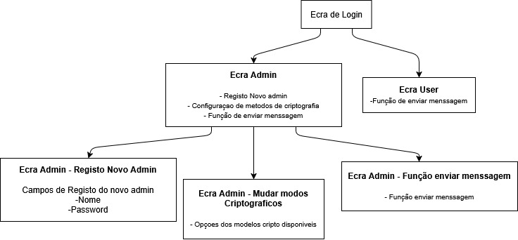

# Projeto – Implementação de uma VPN

Este projeto tem como objetivo implementar e emular uma **Rede Privada Virtual (VPN) simplificada**, usando uma ligação TCP como intermediária entre dois clientes UDP. Para além disso, integra métodos de criptografia configuráveis por um administrador autenticado.

## Arquitetura Geral

A VPN é composta por:

* **ProgUDP1**: Cliente UDP 1
* **ProgUDP2**: Cliente UDP 2
* **VPN Client**: Cliente intermediário que liga ao servidor por TCP
* **VPN Server**: Servidor central que intermedeia a comunicação entre os dois clientes UDP

## Funcionalidades Implementadas

* Encaminhamento de mensagens UDP através de túnel TCP
* Criptografia simétrica usando **Cifra de César Generalizada**
* Troca de chaves por **algoritmo Diffie-Hellman**
* Interface de administração:

  * Registo de novos administradores
  * Configuração de métodos criptográficos
  * Envio de mensagens
* Interface de utilizador comum:

  * Envio de mensagens

## Diagrama de Interfaces



## Requisitos

* Python 3.10 ou superior
* Bibliotecas:

  * `socket`
  * `threading`
  * `hashlib`
  * `random`

## Estrutura do Projeto

O repositório segue uma organização simples para facilitar a execução dos
componentes. Os diretórios principais são:

```
.
├── core/        # Módulos partilhados (configuração, criptografia, gestão de utilizadores)
├── vpn/         # Cliente e servidor VPN sobre TCP
├── udp/         # Clientes UDP de exemplo
├── tests/       # Testes unitários em PyTest
├── assets/      # Diagramas e imagens
├── main.py      # Script que lança todo o sistema de forma integrada
└── requirements.txt
```

Cada módulo pode ser executado isoladamente ou através do `main.py` que arranca
o servidor VPN, o cliente VPN e o receptor UDP de forma automática.

## Como correr o projeto

1. **Clone o repositório e instale as dependências**

   ```bash
   git clone https://github.com/diogoJsaraiva/Criptologia.git
   cd Criptologia
   pip install -r requirements.txt
   ```

2. **Execução rápida**

   Em um único terminal, pode iniciar todos os serviços necessários através do
   script principal:

   ```bash
   python main.py
   ```

   O `main.py` arranca o servidor VPN, o cliente VPN e o `prog_udp2.py` em
   segundo plano, apresentando de seguida o menu de autenticação.

3. **Execução manual (opcional)**

   Caso prefira, pode abrir vários terminais e executar cada componente
   separadamente:

   * Terminal 1 – Servidor VPN

     ```bash
     python vpn/vpn_server.py
     ```

   * Terminal 2 – Cliente VPN

     ```bash
     python vpn/vpn_client.py
     ```

   * Terminal 3 – Cliente UDP receptor

     ```bash
     python udp/prog_udp2.py
     ```

   Depois utilize o `main.py` ou o `prog_udp1.py` para enviar mensagens.

4. **Primeiro acesso ao menu**

   Ao iniciar `main.py` será pedido login. Os dados padrão são:

   * Utilizador: `admin`
   * Password: `admin123`

   O administrador pode registar novos utilizadores, alterar métodos de
   cifra e enviar mensagens. Utilizadores do tipo "user" apenas enviam
   mensagens.

## Como correr os testes

1. Instale as dependências:
   ```bash
   pip install -r requirements.txt
   ```
2. Execute a suíte de testes a partir da raiz do projeto com o **pytest**:
   ```bash
   python -m pytest -q
   ```

3. **Interação Admin/User:**

   * Após login, o utilizador será redirecionado para o ecrã adequado (Admin ou User).
   * O Admin pode:
      * Registar novos administradores
      * Listar, remover e alterar permissões dos utilizadores
      * Mudar os modos de criptografia
      * Enviar mensagens criptografadas
   * O User apenas tem acesso ao envio de mensagens

## Estado do Projeto

* Encaminhamento de mensagens UDP
* Criptografia Cifra de César + Diffie-Hellman
* Interface de login e distinção Admin/User
* Configuração de métodos criptográficos

## Organização por Fases

O projeto está planeado em três grandes etapas conforme a metodologia usada na
UC de Criptologia:

* **Fase&nbsp;1** – Constituição das equipas e definição de requisitos. Produção
  de mockups, primeiros menus e suporte a múltiplos administradores.
* **Fase&nbsp;2** – Implementação das funcionalidades críticas: cifra de César
  generalizada, troca de chave Diffie-Hellman e outros métodos de encriptação,
  bem como consulta de parâmetros TCP.
* **Fase&nbsp;3** – Funcionalidades avançadas, nomeadamente o registo de ações em
  blockchain simples e eventual interface gráfica.

## Autores

Desenvolvido no âmbito da UC de Criptologia – Instituto Politécnico da Guarda (IPG)
2024/2025
